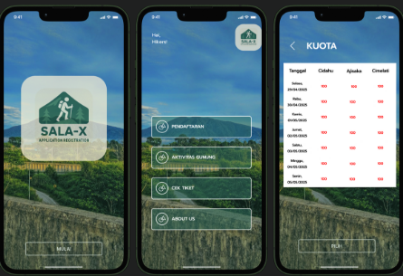

# Eriel Setiawan Dewantoro
*Aspiring Data Enthusiast | Data Science & Analytics*

---

### 👋 About Me
Hello! I am Eriel, a 7th-semester Information Technology student at Universitas Bina Sarana Informatika with a strong interest in data. My goal is to become a Data Analyst/Scientist who helps organizations make better, data-driven decisions. 

- 🎓 Currently studying at **Universitas Bina Sarana Informatika** (2022 - Present).
- 🚀 Participating in **Dibimbing Bootcamp - Data Science & Analytics** (Mei 2025 - Present).
- 💡 Proficient in processing, analyzing, and visualizing data to deliver valuable insights using Python, SQL, Power BI, and Tableau.
- 🤝 Strong believer in teamwork, communication, and continuous learning. 

### 🛠️ Tech Stack & Skills

**Technical Skills:**
- **Languages:** Python (Pandas, NumPy), SQL 
- **Data Viz:** Power BI, Tableau 
- **Machine Learning:** Supervised & Unsupervised Learning, Data Mining 
- **Tools:** VS Code, Jupyter Notebook, Google Colab, DBeaver, MySQL
  
**Soft Skills:**
- Problem Solving 
- Quick Learner & Adaptive 
- Team Collaboration & Communication 
- Time Management
  
**Languages:**
- **Bahasa Indonesia:** Native 
- **English:** Professional Working Proficiency (B1)

---

### 📂 My Projects

| Preview | Project | Description |
|---|---|---|
|  | **WTA Tennis Match Analytics** | An end-to-end analysis of WTA match data, from wrangling in Python to an interactive dashboard in Power BI. Uncovered insights on player performance, upset rates, and predictability by odds.  **(https://github.com/erielsdewantoro/WTA-Tennis-Analysis)** |
|  | **SALA-X: Hiking Registration App** | A mobile web-app concept designed in Figma for managing hiking registrations on Mount Salak, aiming to streamline data management and reporting for administrators.  **(https://github.com/erielsdewantoro/SALA-X-App-UIUX)** |

---

### 📜 Certifications

- **[Program Analyst Certification - BNSP](https://drive.google.com/file/d/1i9S-mlmDZTPBTI-3QAAiL50NKZ4RvmWF/view?usp=drive_link)** (November 2025)
- **[PCAP: Programming Essentials in Python - Cisco & OpenEDG](https://drive.google.com/file/d/1gSWkhpkuTZ10JRfRiFHbWoegejdIG8_x/view?usp=drive_link)** (July 2023)
- **[Fundamental Database MySQL - Coding Studio](https://drive.google.com/file/d/1bmaih4EOUrpHBx26sXwjR_7GuMlNfdF6/view?usp=drive_link)** (June 2024)

---

### 📫 Let's Connect!
- **Email:** erieldewantoros@gmail.com 
- **LinkedIn:** [linkedin.com/in/your-profile](https://www.linkedin.com/)
